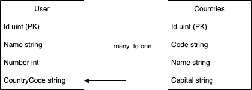

# Go-orm

Learn [GORM](https://github.com/go-gorm/gorm) with examples.

## Requirements

1. Docker for up the data bases (postgres), just do 

```bash 
$ docker-compose up
```

2. Intent access for download [GORM](https://github.com/go-gorm/gorm) and postgres driver. 

## Project

This project, use [GORM](https://github.com/go-gorm/gorm) with practical examples 

The estructure of the project is his

```bash 
.
├── LICENSE
├── README.md
├── docker-compose.yaml
├── go.mod
├── go.sum
├── pgdata //auto create with de data from container
└── src
    ├── connection 
    ├── data
    ├── main.go
    ├── models
    └── query

```

Then you run the application, It will create the tables **Countries** and **Users** in the data base. 

